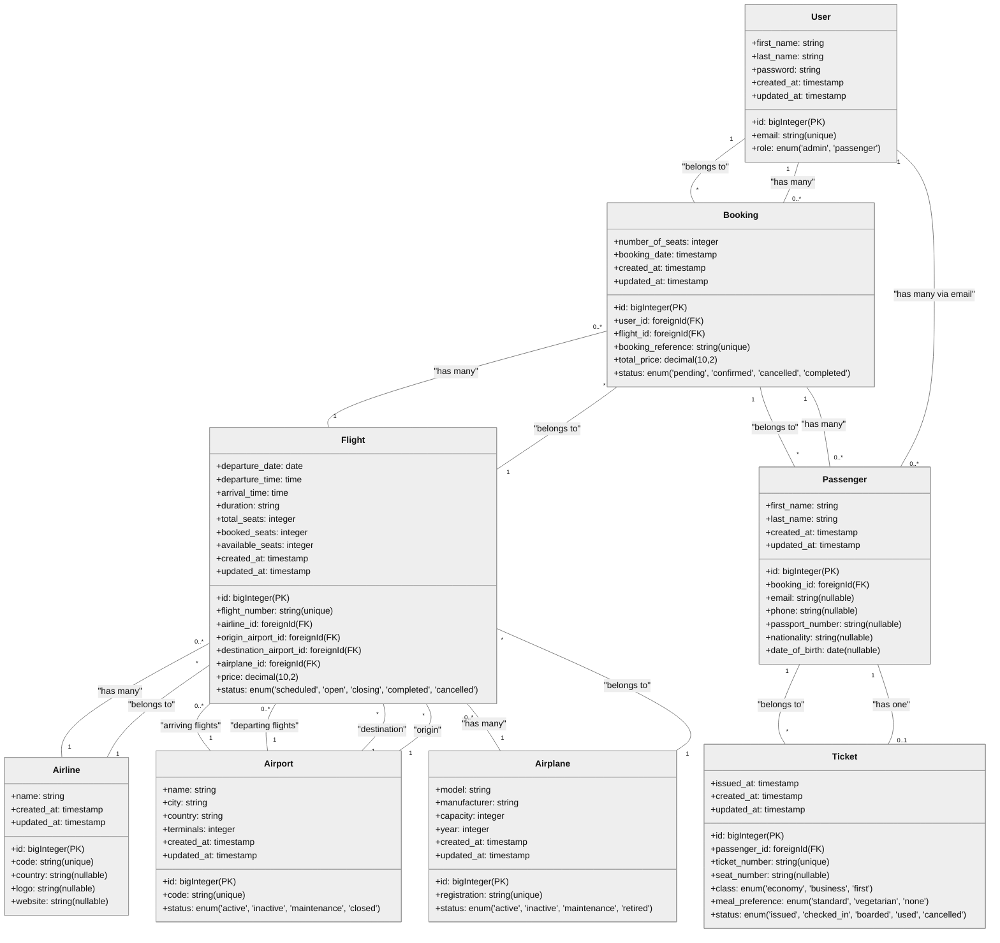

```mermaid
%%{init: { 'theme': 'neutral' } }%%
classDiagram
    class User {
        +id: bigInteger (PK)
        +first_name: string
        +last_name: string
        +email: string (unique)
        +password: string
        +role: enum('admin', 'passenger')
        +created_at: timestamp
        +updated_at: timestamp
    }

    class Airport {
        +id: bigInteger (PK)
        +name: string
        +code: string (unique)
        +city: string
        +country: string
        +terminals: integer
        +status: enum('active', 'inactive', 'maintenance', 'closed')
        +created_at: timestamp
        +updated_at: timestamp
    }

    class Airplane {
        +id: bigInteger (PK)
        +model: string
        +manufacturer: string
        +registration: string (unique)
        +capacity: integer
        +year: integer
        +status: enum('active', 'inactive', 'maintenance', 'retired')
        +created_at: timestamp
        +updated_at: timestamp
    }

    class Airline {
        +id: bigInteger (PK)
        +name: string
        +code: string (unique)
        +country: string (nullable)
        +logo: string (nullable)
        +website: string (nullable)
        +created_at: timestamp
        +updated_at: timestamp
    }

    class Flight {
        +id: bigInteger (PK)
        +flight_number: string (unique)
        +airline_id: foreignId (FK)
        +origin_airport_id: foreignId (FK)
        +destination_airport_id: foreignId (FK)
        +airplane_id: foreignId (FK)
        +departure_date: date
        +departure_time: time
        +arrival_time: time
        +duration: string
        +price: decimal(10,2)
        +total_seats: integer
        +booked_seats: integer
        +available_seats: integer
        +status: enum('scheduled', 'open', 'closing', 'completed', 'cancelled')
        +created_at: timestamp
        +updated_at: timestamp
    }

    class Booking {
        +id: bigInteger (PK)
        +user_id: foreignId (FK)
        +flight_id: foreignId (FK)
        +booking_reference: string (unique)
        +number_of_seats: integer
        +total_price: decimal(10,2)
        +status: enum('pending', 'confirmed', 'cancelled', 'completed')
        +booking_date: timestamp
        +created_at: timestamp
        +updated_at: timestamp
    }

    class Passenger {
        +id: bigInteger (PK)
        +booking_id: foreignId (FK)
        +first_name: string
        +last_name: string
        +email: string (nullable)
        +phone: string (nullable)
        +passport_number: string (nullable)
        +nationality: string (nullable)
        +date_of_birth: date (nullable)
        +created_at: timestamp
        +updated_at: timestamp
    }

    class Ticket {
        +id: bigInteger (PK)
        +passenger_id: foreignId (FK)
        +ticket_number: string (unique)
        +seat_number: string (nullable)
        +class: enum('economy', 'business', 'first')
        +meal_preference: enum('standard', 'vegetarian', 'none')
        +status: enum('issued', 'checked_in', 'boarded', 'used', 'cancelled')
        +issued_at: timestamp
        +created_at: timestamp
        +updated_at: timestamp
    }

    %% RELATIONSHIPS
    User "1" -- "0..*" Booking : "has many"
    User "1" -- "0..*" Passenger : "has many via email"
    
    Airport "1" -- "0..*" Flight : "departing flights"
    Airport "1" -- "0..*" Flight : "arriving flights"
    
    Airplane "1" -- "0..*" Flight : "has many"
    Airline "1" -- "0..*" Flight : "has many"
    
    Flight "*" -- "1" Airline : "belongs to"
    Flight "*" -- "1" Airport : "origin"
    Flight "*" -- "1" Airport : "destination"
    Flight "*" -- "1" Airplane : "belongs to"
    Flight "1" -- "0..*" Booking : "has many"
    
    Booking "*" -- "1" User : "belongs to"
    Booking "*" -- "1" Flight : "belongs to"
    Booking "1" -- "0..*" Passenger : "has many"
    
    Passenger "*" -- "1" Booking : "belongs to"
    Passenger "1" -- "0..1" Ticket : "has one"
    
    Ticket "*" -- "1" Passenger : "belongs to"
```